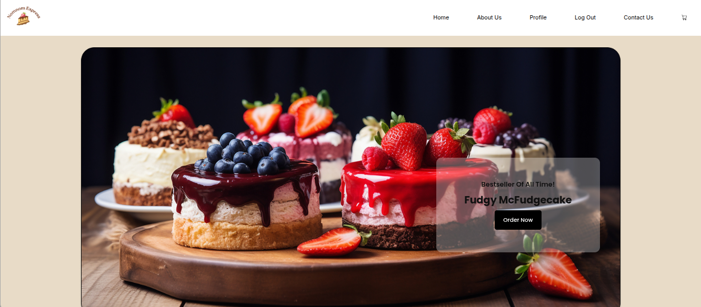
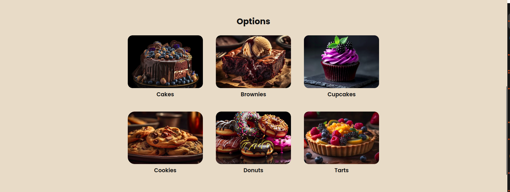
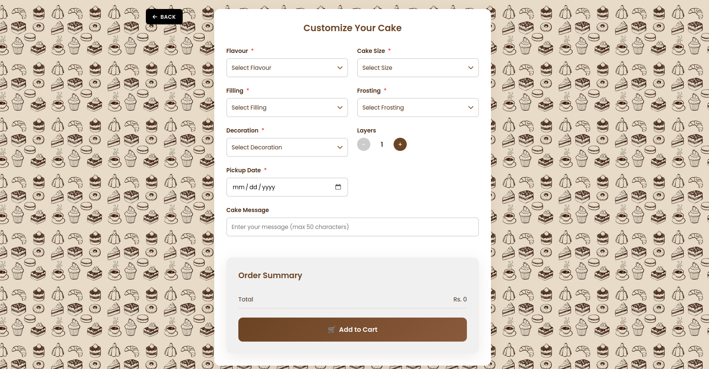
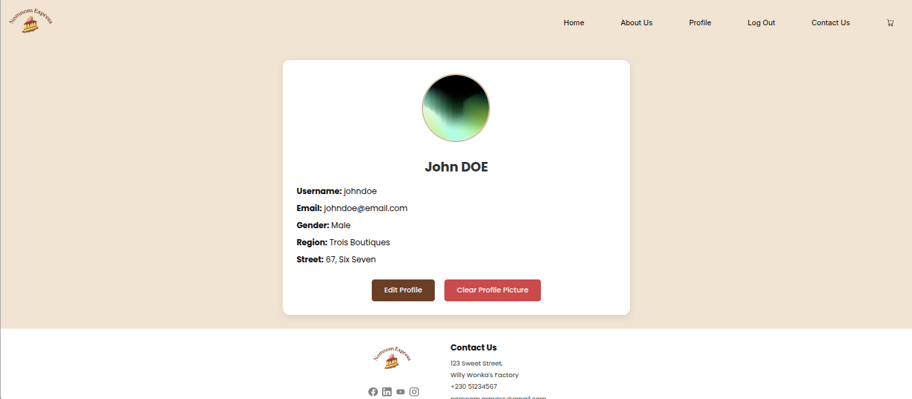
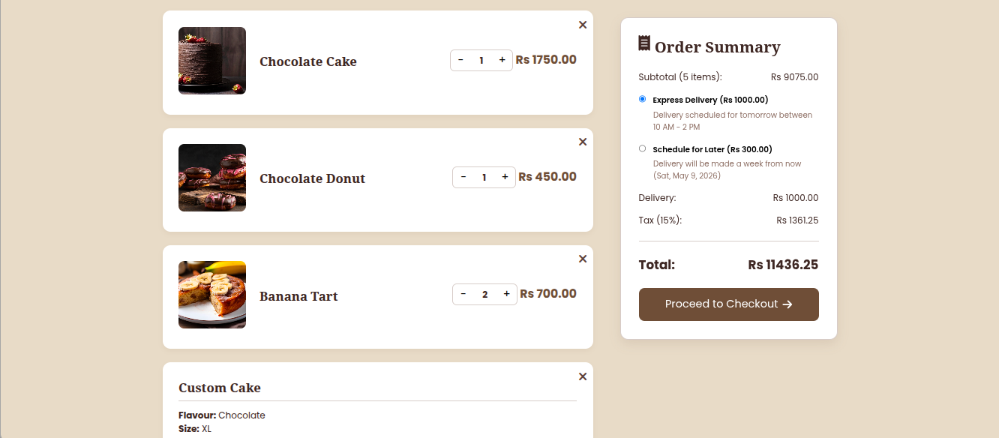
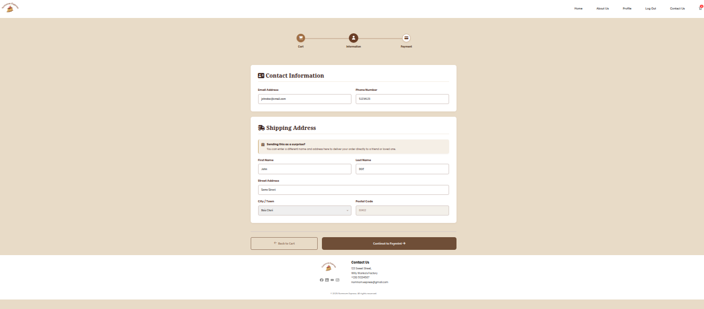
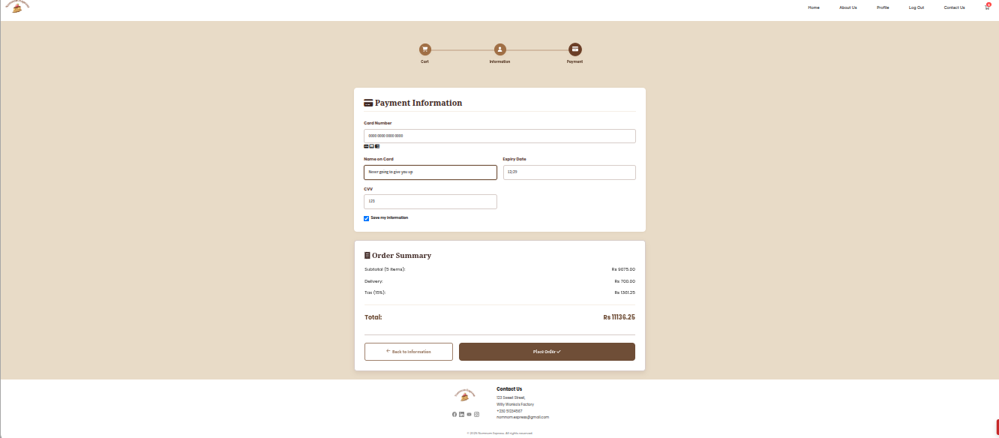
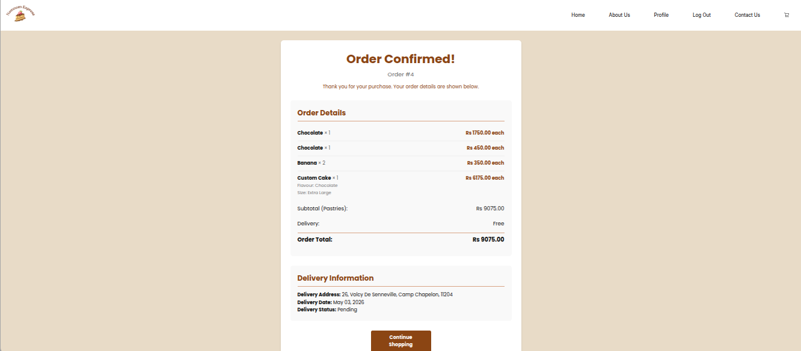
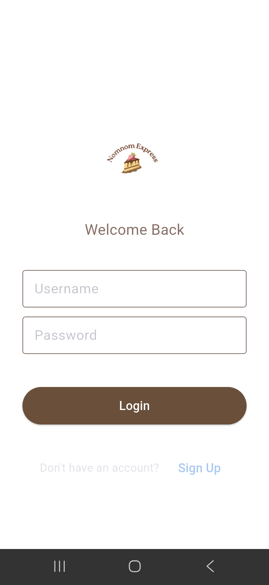

# NomNom Pastry Shop

An e-commerce web application built with Django for a pastry shop. The application allows customers to browse different categories of pastries, customize cakes, add items to their cart, and place orders. The platform also provides user authentication and profile management features.

> [!NOTE]
> Resources used while building and learning:
>
> - Official Django documentation: <https://docs.djangoproject.com/>
> - Django tutorial series and community examples for e-commerce patterns
> - HTML/CSS/JavaScript best practices for responsive UI design

# Features

- Multiple pastry categories (Cakes, Brownies, Donuts, Cookies, Tarts, Cupcakes)
- Custom cake builder with flavors, fillings, frostings, decorations, and sizing options
- User authentication and profile management
- Shopping cart functionality (persistent for authenticated users, session-based for guests)
- Order management system with history tracking
- Responsive web design for desktop and mobile devices
- Admin panel for managing products and orders
- REST API (Django REST Framework) for mobile/external clients
- Mobile app client (Flet) under `mobile-app/`

# Usage

## Setting Up the Development Environment ( Web and App )

1. Clone the repository:

```bash
git clone <repository-url>
```

1. Navigate to the project directory and create a virtual environment:

```bash
cd NomNom
python -m venv venv
```

1. Activate the virtual environment:

- On Linux/Mac:

```bash
source venv/bin/activate
```

- On Windows:

```bash
venv\Scripts\activate
```

1. Install the required dependencies:

```bash
pip install -r requirements.txt
```

1. Create and apply database migrations:

```bash
python NomNom/manage.py makemigrations
python NomNom/manage.py migrate
```

1. Populate the database with initial products:

```bash
python NomNom/sync_products.py
```

1. Create a superuser account:

```bash
python NomNom/manage.py createsuperuser
```

1. Configure environment variables by creating a `.env` file in the project root ( next to `README.md` file ) with:

```
EMAIL_HOST_USER=your_gmail_address
EMAIL_HOST_PASSWORD=your_gmail_app_password
DEFAULT_FROM_EMAIL=your_gmail_address
```

> [!WARNING]
> Create your 'App Password' using the following link: <https://myaccount.google.com/apppasswords>

1. Load data regarding pastries using Python script

```bash
python NomNom/sync_products.py
```

1. Start the development server:

```bash
python NomNom/manage.py runserver
```

The application will be accessible at `http://127.0.0.1:8000/`

## Admin Panel

Access the Django admin panel at `http://127.0.0.1:8000/admin/` using the superuser credentials created in step 7.

## User Registration and Login

New customers can register by clicking on the "Register" link in the navigation bar. Existing users can log in using their credentials.

> [!TIP]
> As of now, you can also simply run the Django development server and simply login like a regular user but using administrator credentials.

## Browsing Products

Customers can browse different categories of pastries from the main landing page or through the navigation menu. Each pastry displays its name, price, and image.

## Custom Cake Builder

The cake customization feature allows customers to create personalized cakes by selecting:

- Cake flavor
- Filling options
- Frosting type
- Decorations
- Size and number of layers
- And more!

## Shopping Cart

Customers can add items to their shopping cart, update quantities, and remove items as needed. The cart item count is displayed across all pages.

## Order Process

After adding items to the cart, customers can proceed to checkout, enter their shipping information, and complete their order.

# Mobile Application with Flet

The mobile app lives under `mobile-app/` and uses the Django REST API under `/api/v1/`.

## Running the Mobile App

1. Make sure the Django server is running (keep this terminal open):

```bash
python NomNom/manage.py runserver
```

1. (Optional) Set the API base URL used by the mobile app

The mobile app defaults to:

- `http://localhost:8000/api/v1`

You can override it with `NOMNOM_API_URL`:

- On Linux/Mac:

```bash
export NOMNOM_API_URL="http://127.0.0.1:8000/api/v1"
```

- On Windows (PowerShell):

```powershell
setx NOMNOM_API_URL "http://127.0.0.1:8000/api/v1"
```

1. Run the Flet app (in a second terminal, same venv activated):

```bash
cd mobile-app
flet run
```

Other run modes:

- Desktop app:

```bash
flet run
```

- Web app:

```bash
flet run --web
```

- Android testing:

```bash
flet run --android
```

- iOS testing:

```bash
flet run --ios
```

> [!NOTE]
> If `flet` is not found, run:
>
> `python -m flet run`
>
> (and similarly: `python -m flet run --android`, `python -m flet run --web`, etc.)

# Project Structure

```
NomNom/
├── README.md
├── requirements.txt
├── .env                # Environment variables (user-created)
├── screenshots/
├── mobile-app/         # Flet mobile client
│   ├── pyproject.toml
│   ├── src/
│   │   ├── main.py
│   │   ├── config.py
│   │   ├── assets/
│   │   ├── auth/
│   │   │   ├── auth_service.py
│   │   │   └── screens/
│   │   │       ├── login_screen.py
│   │   │       └── register_screen.py
│   │   ├── home/
│   │   │   ├── home_service.py
│   │   │   └── home_screen.py
│   │   ├── orders/
│   │   │   ├── orders_service.py
│   │   │   ├── orders_screen.py
│   │   │   └── screens/
│   │   │       └── order_detail_screen.py
│   │   ├── deliveries/
│   │   │   ├── deliveries_service.py
│   │   │   ├── deliveries_screen.py
│   │   │   ├── delivery_confirmation_screen.py
│   │   │   └── screens/
│   │   │       └── map_screen.py
│   │   └── common/
│   │       ├── api_client.py
│   │       ├── navigation.py
│   │       ├── storage.py
│   │       ├── error_handler.py
│   │       ├── formatters.py
│   │       └── logger.py
│   └── test_map.py
└── NomNom/             # Django project folder (apps, settings, scripts)
    ├── manage.py
    ├── sync_products.py
    ├── db.sqlite3      # SQLite database (created after migrate)
    ├── NomNom/         # Main Django project settings package
    ├── about_us/       # About us page application
    ├── cart/           # Shopping cart functionality
    ├── common/         # Shared utilities (business stats, etc.)
    ├── contact/        # Contact page application
    ├── delivery/       # Delivery tracking application
    ├── landing/        # Main landing page application
    ├── login/          # User authentication and login application
    ├── orders/         # Order management application
    ├── pastry/         # Pastry catalog and customization
    ├── payments/       # Payment processing application
    ├── profile_page/   # User profile management
    └── review/         # Reviews application
```

## Screenshots

## Web Application

- Landing Page:
  

- Pastry Categories:
  

- Custom Cake Builder:
  

- User Profile:
  

- Shopping Cart and Payment:
  
  
  
  

## Mobile Application

- Start Page:
  

- Homepage:
  

- Order Search:
  

- Geolocation:
  

# Technologies Used

- Python
- Django
- Django REST Framework (API)
- HTML5
- CSS3
- JavaScript
- SQLite (default)
- Bootstrap (for responsive design)
- Flet (mobile app)

# Configuration

The application uses environment variables for sensitive information such as the Django secret key and email settings. These should be set up in a `.env` file in the project root as described in the setup instructions.
